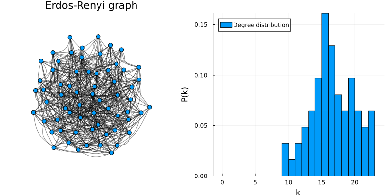
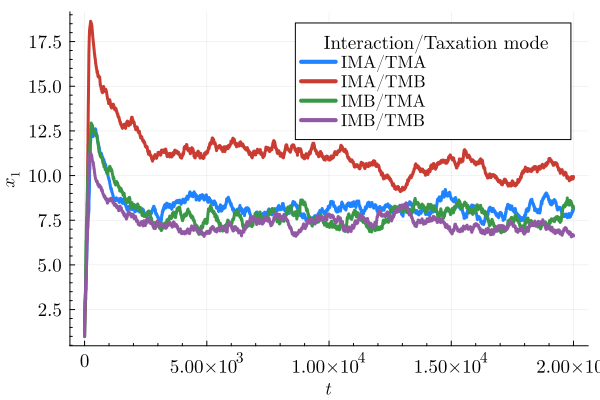
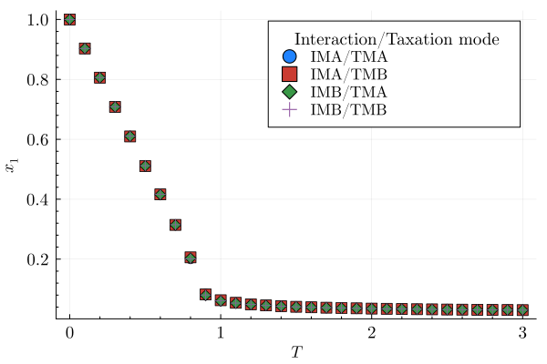

# Import necessary packages

```julia
using Pkg; Pkg.activate(".")
using YardSale, Graphs
using Plots, GraphRecipes, LaTeXStrings
using ProgressMeter, JLD2
using Statistics
```

In this notebook, we will explore some of the functionalities implemented for the Monte Carlo simulations in the `YardSale.jl` package. We'll describe how to run simulations in arbitrary networks, using different taxation and interaction schemes, and briefly discuss the results obtained.

# Build a graph using the Graphs.jl package

```julia
# Instantiate a graph
N = 64
# Expected mean degree
k_mean = 16 
# Erdos-Renyi graph, seed = 42
g = erdos_renyi(N, k_mean/(N-1), seed=42)
```

    {64, 524} undirected simple Int64 graph

```julia
# Plot the graph
p1 = graphplot(
    g,
    markersize=0.15,
    markershape=:circle,
    edgelinewidth=0.1,
    linealpha=0.5,
    size=(400, 400),
    title="Erdos-Renyi graph",
)

# Plot the degree distribution
p2 = histogram(degree(g), bins=0:1:maximum(degree(g)), normed=true,
                label="Degree distribution",xlabel="k",ylabel="P(k)",
                legend=:topleft)
p = plot(p1, p2, layout=(1,2), size=(800, 400))
```



Over this network, we will run a Monte Carlo simulation of our generalized version of the Extended Yard-Sale Model. In this generalization, we specify an interaction mode for the agents (defining the way they exchange wealth) and a taxation mode (defining the way the government collects taxes and redistributes wealth). The interaction modes available are:

- Interaction Mode A: At each time step, a random link is chosen at random.
- Interaction Mode B: At each time step, a random agent and one of its neighbors are chosen at random.

The taxation modes available are:

- Taxation Mode A: At each time step, The agents who exchange wealth pay taxes.
- Taxation Mode B: Two agents at random are chosen to pay taxes.
  The redistribution ocurrs homogeneously, i.e., the total amount of taxes collected is redistributed equally among all agents.

The idea is to explore the effects of different interaction and taxation modes on the wealth distribution of the agents, at different temperatures.

# Run the simulations

```julia
# Parameters 
# Mean wealth
W_N = 1.0f0
chi = 0.15f0
zeta = 1.0f0
f = 0.01f0
# Interaction modes
IM = ["A","B"]
# Taxation modes
TM = ["A","B"]
seed = 42
steps = 20000 * N
;
```

```julia
# This cell may take a while to run...
results = Dict()
for interaction_mode in IM
    for taxation_mode in TM
        println("Running simulation for IM$(interaction_mode), TM$(taxation_mode)")
        # Run the simulation
        res = EYSM_net_full(g, W_N, interaction_mode, taxation_mode,
        chi, zeta, f, steps, seed)
        results["$(interaction_mode),$(taxation_mode)"] = res
    end
end
```

    Running simulation for IMA, TMA
    Running simulation for IMA, TMB
    Running simulation for IMB, TMA
    Running simulation for IMB, TMB

```julia
# Save the results
save("eysm_net_base.jld2", "results", results)
;
```

```julia
# Load the results (if needed)
#using JLD2
#results = load("eysm_net_base.jld2")["results"]
```

    Dict{Any, Any} with 4 entries:
      "B,A" => Float32[1.0 1.0 … 1.0 1.0; 0.847615 0.870765 … 0.995251 1.08111; … ;…
      "B,B" => Float32[1.0 1.0 … 1.0 1.0; 1.05025 0.88395 … 1.03223 0.882832; … ; 0…
      "A,B" => Float32[1.0 1.0 … 1.0 1.0; 1.0417 1.11445 … 0.877517 0.903814; … ; 0…
      "A,A" => Float32[1.0 1.0 … 1.0 1.0; 1.11878 1.12205 … 0.889989 0.913464; … ; …

```julia
# Plot the results for the different scenarios
x1 = Dict()
for (key, value) in results
    x1[key] = get_x1(value)
end

p = plot(
    fontfamily="Computer Modern",
    xlabel=L"t",
    ylabel=L"x_1",
    palette=:julia,
    minorticks=true,
    legend_title = "Interaction/Taxation mode",
    xguidefontsize = 12,
    yguidefontsize = 12,
    legendfontsize = 11,
    legendtitlefontsize = 12,
    xtickfontsize = 12,
    ytickfontsize = 12,
)

for interaction_mode in IM
    for taxation_mode in TM
        key = "$(interaction_mode),$(taxation_mode)"
        label = "IM$(interaction_mode)/TM$(taxation_mode)"
        plot!(p, x1[key], label=label,lw=3)
    end
end

display(p)
```



# Equivalence of the 4 combinations of interaction and taxation modes for fully connected networks

We want to make this test for 2 reasons:

- To check if the implementation is correct
- To demonstrate the equivalence of our theoretical model with the original one by Boghosiant et al. (2017) in the case of fully connected networks.

To do this, we will run 4 sets of simulations, one for each combination of interaction and taxation modes, in a fully connected network. We will then compare the results obtained. For each combination, we will run 1 simulation at each temperature value in the range `0:0.1:3`. Then in the steady state we'll measure the value of $x_1$ and finally plot the $x_1$ vs. $T$ curves for each interaction/taxation mode.

```julia
# Graph parameters
N = 64
# Probability of connection (1 for a fully connected graph)
p = 1.0
g = erdos_renyi(N, p,seed=42)

# Simulation parameters
W_N = 1.0f0
chi = 0.0f0:0.1f0:3.0f0
zeta = 1.0f0
f = 0.01f0
steps = 40000 * N 
seed = 42
IM = ["A","B"]
TM = ["A","B"]
;
```

```julia
# This cell may take a while to run...

results = Dict()

for interaction_mode in IM
    for taxation_mode in TM
        println("Running simulations for IM$(interaction_mode), TM$(taxation_mode)")
        im_tm = []
        @showprogress for c in chi
            res_c = EYSM_net_full(g, W_N, interaction_mode, taxation_mode,
            c, zeta, f, steps, seed)
            push!(im_tm, get_x1(res_c))
        end
        results["$(interaction_mode),$(taxation_mode)"] = im_tm
    end
end

# Save the results
save("eysm_net_chi.jld2", "results", results)
```

```julia
# Load the results (if needed)
#using JLD2
#results = load("eysm_net_chi.jld2")["results"]
```

    Dict{Any, Any} with 4 entries:
      "B,A" => Any[Float32[1.0; 1.22125; … ; 64.0; 64.0;;], Float32[1.0; 1.22054; ……
      "B,B" => Any[Float32[1.0; 1.21331; … ; 64.0; 64.0;;], Float32[1.0; 1.21311; ……
      "A,B" => Any[Float32[1.0; 1.22679; … ; 64.0; 64.0;;], Float32[1.0; 1.22648; ……
      "A,A" => Any[Float32[1.0; 1.20624; … ; 64.0; 64.0;;], Float32[1.0; 1.20611; ……

```julia
# Process the results
# Index of the time step where the system reaches a steady state 
# (can be checked by plotting)

steady_state = 20000
x1 = Dict()
for taxation_mode in TM
    for interaction_mode in IM
        x1_imtm = []
        for c in 1:length(chi)
            key = "$(interaction_mode),$(taxation_mode)"
            push!(x1_imtm, mean(results[key][c][steady_state:end])/N)
        end
        x1["$(interaction_mode),$(taxation_mode)"] = x1_imtm
    end
end
```

```julia
# Plot the results
p = plot(
    fontfamily="Computer Modern",
    xlabel=L"T",
    ylabel=L"x_1",
    palette=:julia,
    minorticks=true,
    legend_title = "Interaction/Taxation mode",
    xguidefontsize = 12,
    yguidefontsize = 12,
    legendfontsize = 11,
    legendtitlefontsize = 12,
    xtickfontsize = 12,
    ytickfontsize = 12,
)

markers = [:circle, :square, :diamond, :cross]
marker_idx = 1
for interaction_mode in IM
    for taxation_mode in TM
        key = "$(interaction_mode),$(taxation_mode)"
        label = "IM$(interaction_mode)/TM$(taxation_mode)"
        scatter!(p, chi ./ zeta, x1[key], label=label,ms=6,markershape=markers[marker_idx])
        marker_idx += 1
    end
end
display(p)
```



As we can see, all the interaction/taxation modes yield the same results, as expected. This is because in a fully connected network, the agents are all equivalent, and the interaction and taxation modes do not affect the wealth distribution. This is a good test to check if the implementation is correct.
