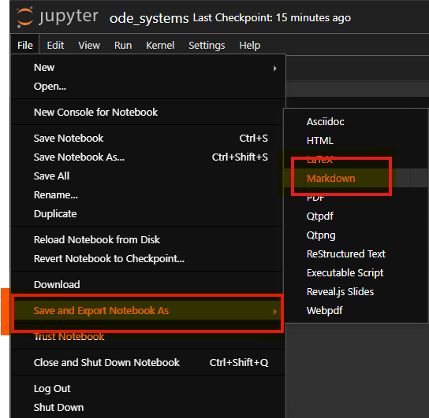

# Tutorials

This directory contains a series of Jupyter notebooks that describe the basic
functionalities of the `YardSale.jl` package. The notebooks serve as the primary basis for
the _Examples_ section of the documentation. The tutorials are organized as follows:

An specific Julia project has been created for this tutorials section, adding the `Plots.jl`
package and other dependencies to the [Project.toml](Project.toml) file.

## How to go from the notebooks to the documentation?

The notebooks are converted to markdown files using the IJulia interface of Julia.
The markdown files are then included in the documentation using the `Documenter.jl` package.

If you'd like to reproduce the documentation, please follow the steps below:

1. In the terminal, activate Julia using the tutorials project:

```bash
julia --project=tutorials
```

2. Run the following commands to open the Jupyter notebook interface:

```julia
using IJulia
notebook(dir=".")
```

3. Open the desired notebook.
4. Run the notebook and save it as a markdown file.

